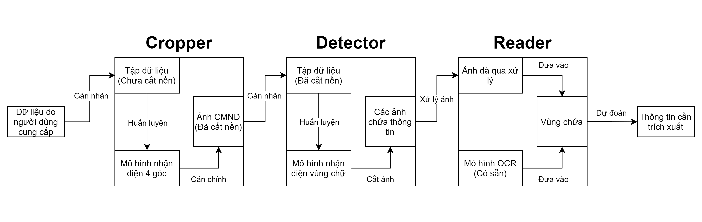
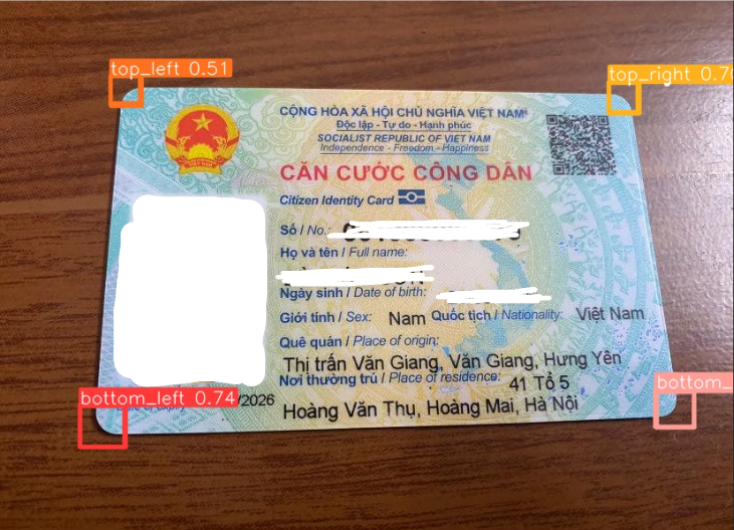
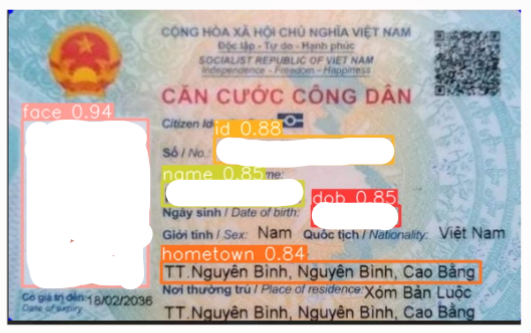

## Website for Recognizing and Extracting Information from Vietnamese Identity Cards
In this project, i build models using YOLOv8 for detection and TransformerOCR for information extraction. Additionally, we apply image alignment and preprocessing techniques to improve the accuracy of detection and extraction. Finally, we develop a website using Flask and ngrok for end-users to utilize the extraction functionality.
Libraries Used

* YOLOv8
* VietOCR
* Label Studio
* Flask
* pyngrok

## Clone source code
```bash
%cd /content/drive/My Drive/test
!git clone https://github.com/zet-rutherford/eKYC.git
```
## Pre-trained Models
Download [here](https://drive.google.com/drive/u/0/folders/1ouUg-HtHcA9UO2-WYBrFT-vXVsMn-Bey)
## Requirements
Create an account on ngrok and generate a token to connect with the ngrok server.
## DESIGN AND IMPLEMENTATION
### Overall Architecture

### Dataset
The dataset for the models consists of the front side of Vietnamese identity cards. I collected 400 images. The images satisfy various conditions such as being captured from different angles and sizes, varying resolutions (high or low), overexposure or underexposure, and different background settings. I split the dataset into three parts: train (300 images), validation (50 images), and test (50 images).
Due to privacy concerns, I am unable to share the dataset.
### Cropper
Training the Corner Detection Model (detect_corners.pt)

Then using Wrap Perspective with 4 center of 4 corners box after using NMS to get rid of some boxes in same place
### Detector
Training the Information Detection Model (extract_info.pt)

### Reader
Image Preprocessing
* Image Resizing: The image is resized by a scale factor of 1.5 in both width and height using cv2.resize with cv2.INTER_CUBIC interpolation.
* Grayscale Conversion: The image is converted from the RGB color space to grayscale using cv2.cvtColor.
* Shadow Removal: A shadow removal technique is applied to improve contrast. It involves applying dilate and medianBlur operations on each color channel, then calculating the difference between the channel and the blurred background image. The result is a new image with shadows removed.
* Dilation and Erosion: Dilation and erosion operations are performed to remove some noise from the image.
* Blurring: The cv2.GaussianBlur method is used to blur the image, helping to smooth out the edges.
* Brightness and Contrast Adjustment: Finally, the automatic_brightness_and_contrast function is called to adjust the brightness and contrast of the image, making it more crisp and clear.